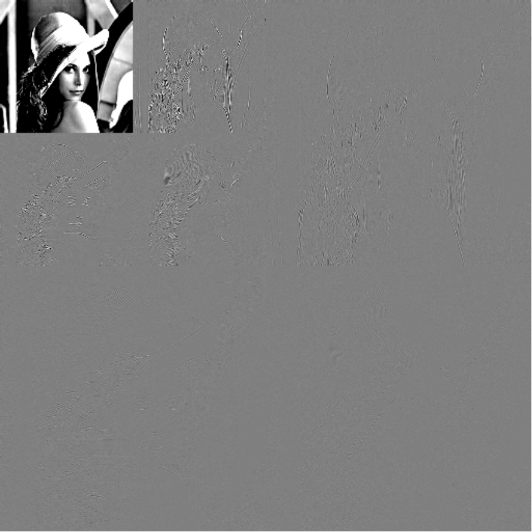
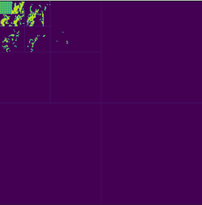
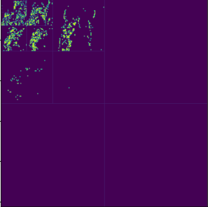
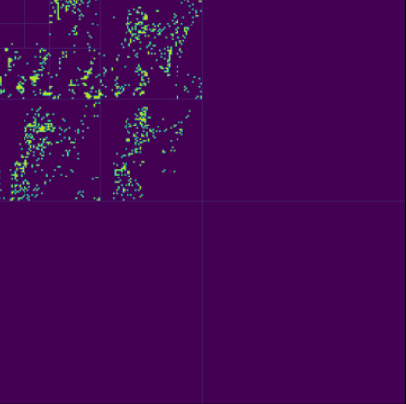
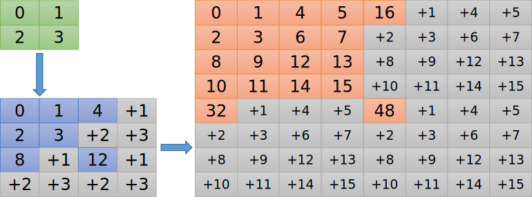
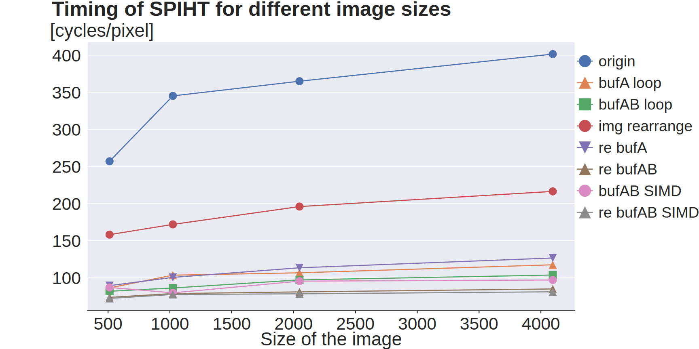
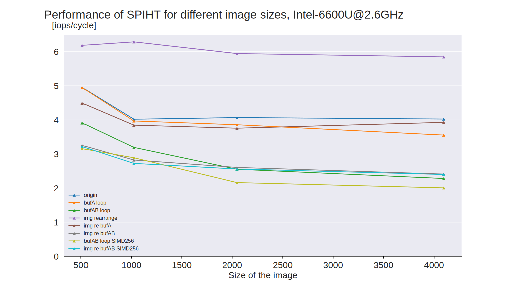

# 一种四叉树的内存友好表示

在2021年春季学期的Advanced System Lab中，我们选择了图像压缩算法SPIHT进行性能优化，其中我为了优化编码过程中对于四叉树的访问，开发了一种全新的四叉树索引方式。

## 问题分析

SPIHT压缩分为两步，第一步是小波变换，将原图分离成横向细节、纵向细节、对角细节以及主要成分:



第二步是SPIHT编码，其中对于子节点的访问并不十分内存友好。从整体上看，编码的过程大体遵循从四叉树根部到叶子的顺序，反映到二维图像上，访问顺序就是从左上的主要成分，分散到其他三个方向上的细节：

  

这对于实际上使用一维数组来储存的图像而言，几乎是随机访问，并不能享受到顺序访问带来的性能。

另一方面，对于每个节点的四个子节点的依次访问也是十分常见的操作，但是四个节点分布在 $2 \times 2$ 的小格子上，导致仅仅访问四个元素就会产生两次 cache miss，而如果这四个元素连续，就只需要一次 cache miss。所以，我们需要一种新的四叉树索引方式，来适应SPIHT的访问模式。

## 新的索引方式定义

让我们先考虑最简单的情况。如果只需要重排一个$2 \times 2$的块，如图中绿色块所示，那么把元素$y\times W+x, y\times W+x+1, (y+1)\times W +x, (y+1)\times W+x+1$（其中$W$是图片宽度）移动到$0,1,2,3$的位置即可。如果需要重排一个$4 \times 4$的数组（蓝色块），那么位于左上角$2 \times 2$块的父节点们可以按照之前$2\times 2$的块方式重排。为了保持四叉树的父子结构，元素$1,2,3$的子节点应该对应到元素$4,8,12$，这样中间的空隙刚好可以放下其他三个子节点，于是元素$4,8,12$的位置也确定了。对于剩下的三个子节点，可以按照$2 \times 2$块的方法局部重排。这样，我们就得到了一个完整的$4 \times 4$重排。



通过归纳，我们可以使用递归的方式定义出新的索引：

1. 基础情况：对于$2 \times 2$块，直接按顺序重排；
2. 递归：对于$2N \times 2N$块，首先将其分为四个$N \times N$块，并将其起始索引设置为$0, N^2, 2N^2, 3N^2$，然后使用$N \times N$块的重排方法，最后组合在一起。

通过这种递归，我们可以不断地拓展这种索引，直到足以容纳所需要处理的图片，就可以停止并继续接下来的编码过程了。

## 性能分析

对于整体的访问模式，左上角的元素都位于索引$\frac{1}{4} N^2$以下，其他三个方向的元素都位于索引$\frac{3}{4} N^2$以上，因此整体访问的模式可以近似于顺序访问。对于局部的四个子节点访问，现在四个元素在连续的空间上，因此最多只有一次cache miss，极大地减少了cache miss。同时，这种索引方式中，对于元素$i$的子节点访问简化为索引$4i,4i+1,4i+2,4i+3$，只需要一维索引来储存四叉树，可以进一步节省存储空间。

下面我们来看一下实验结果：





图中蓝色线是原始版本，红色线是使用新的四叉树索引的优化版本，仅仅通过优化内存组织形式，就可以减少50%的时间，同时性能上升到 6 IPC，接近 8 IPC的理论上限。

## 代码实现

我们使用C递归实现构建索引表：

```c
static void build_rearrange_table(int *table, int width, int block, int cnt) {
    if (block == 1) {
        table[0] = cnt;
        table[1] = cnt + 1;
        table[width] = cnt + 2;
        table[width + 1] = cnt + 3;
        return;
    }
    build_rearrange_table(table, width, block / 2, cnt);
    build_rearrange_table(table + block, width, block / 2, cnt + block * block);
    build_rearrange_table(table + block * width, width, block / 2,
                          cnt + 2 * block * block);
    build_rearrange_table(table + block * width + block, width, block / 2,
                          cnt + 3 * block * block);
}
```

`table`存放构建出来的索引表，`width`是索引表宽度，`block`是当前正在处理的块大小，`cnt`是索引。

利用这个索引表，可以重排整张图片：

```c
static void rearrange_img(SPIHT *p_spiht, int *dst, int *src, int block) {
    int lx = p_spiht->lx;
    int ly = p_spiht->ly;
    int width = p_spiht->width;
    if (block == lx / 2) {
        int *table = p_spiht->im_re_table;
        for (int j = 0; j < ly; j++) {
            for (int i = 0; i < lx; i++) {
                dst[table[j * lx + i]] = src[j * width + i];
            }
        }
        return;
    }
    rearrange_img(p_spiht, dst, src, block / 2);
    rearrange_img(p_spiht, dst + 1 * block * block, src + block, block / 2);
    rearrange_img(p_spiht, dst + 2 * block * block, src + block * width, block / 2);
    rearrange_img(p_spiht, dst + 3 * block * block, src + block * width + block,
                  block / 2);
}
```

需要注意的是，在实际实现中，我们并没有创建一张和整张图像同等大小的索引表，因为在一次编码中，索引表只会使用一次，使用过大的索引表会造成浪费；我们只构建了最左上角图像块大小的索引表，然后使用递归的方式重排整张图片，并利用索引表提前返回，从而达到了索引表大小和递归深度的平衡。
